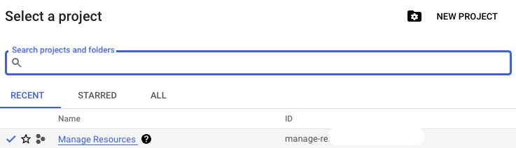
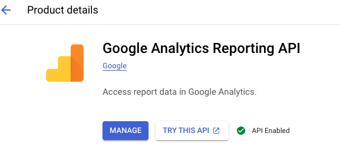
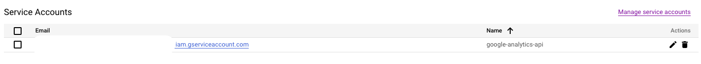
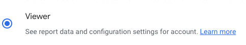
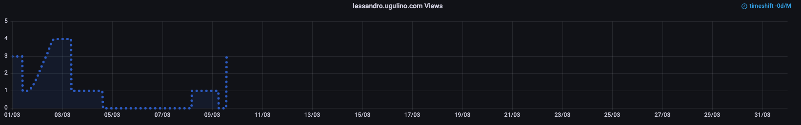

# Daily Google Analytics v4 to Prometheus

Get Daily Google Analytics v4 metrics, and presents them to prometheus for scraping via Pushgateway.

## Index

- [Requirements](#requirements)
- [Generate Google Service Account Key](#generate-google-service-account-key)
- [Share GA access with the service account](#share-ga-access-with-the-service-account)
- [Example: K8s deployment](#example-k8s-deployment)
- [Required Environment Variables](#required-environment-variables)
- [Grafana Dashboard](#grafana-dashboard)

## Requirements

- <a href=https://github.com/prometheus/pushgateway>Pushgateway</a>
- Google Service Account Key

## Generate Google Service Account Key

- Go to Google Cloud Platform (https://console.cloud.google.com/)
- Select one of the projects, or create one if you don't have one. [NEW PROJECT]



- Go to "APIs & Services" (https://console.cloud.google.com/apis/) with the selected project
- Search for "Google Analytics Reporting API", and enable it



- Go to 'Credentials' -> 'Create Credentials' -> 'Service Account'

- Give a name to the service account, then click "Done"



- A service account is created, copy it as we will need to add it into GA next step

- Then Go to "KEYS" / "ADD KEY" / "CREATE NEW KEY", choose "JSON" and a JSON Key file will be generated. Saved the file as `ga_creds.json` into the working folder (or somewhere you can remember). You'll need to map this path to the docker volume.

## Share GA access with the service account

- Login to the Google Analytics
- Go to ‘Admin’ -> Account Access Management
- Grant 'Viewer' access to the service account we copied in the previous step (Or ask admin to grant it if you don’t have the right).



## Using Docker to deploy GG-Daily

1. Copy `docker-compose.yml.example` to `docker-compose.yml` and update as needed. See example below: Docker-compose example:

```yaml
version: "3"

services:
  gg_analytics:
    container_name: gg_daily_prometheus
    image: lugulino/py3_googleanalytics_exporter:v0.1.9
    environment:
      PUSHGWIP: "10.109.37.105" # PushGateway IP Address
      VIEW_ID: "116554343" # Your Google Analytics View ID
    # Volumes store your data between container
    volumes:
      - "./gg_analytics:/app" # the location of the file ga_creds.json created above
    restart: unless-stopped
```

2. Run `docker compose up -d` to build and start the application (Syntax may be docker-compose on older systems)

## Example: K8s deployment

The below code show an example of deploying a cronjob where it'll daily at 5am (Brisbane time) this docker image on Kubernetes

```yaml
---
apiVersion: batch/v1
kind: CronJob
metadata:
  namespace: default
  name: run-gg-analytics
spec:
  schedule: "*/2 * * * *" # Run the Cronjob every 2 minutes
  concurrencyPolicy: Forbid
  successfulJobsHistoryLimit: 0
  failedJobsHistoryLimit: 0
  jobTemplate:
    spec:
      completions: 1
      template:
        metadata:
          labels:
            app: run-gg-analytics
          annotations:
            linkerd.io/inject: disabled
        spec:
          containers:
            - name: cronjob-gg-analytics
              image: lugulino/py3_googleanalytics_exporter:v0.1.9
              volumeMounts: # Volume mount
                - name: gg-analytics
                  mountPath: /app
              env:
                - name: PUSHGWIP # PushGateway IP Address
                  value: "10.109.37.105"
                - name: VIEW_ID # Your Google Analytics View ID
                  value: "116554343"
          restartPolicy: OnFailure
          volumes:
            - name: gg-analytics
              persistentVolumeClaim:
                claimName: gg-analytics-pvc
      backoffLimit: 0
```

## Required Environment Variables

| Variable   | Value                         | Description                                                                                                                                                                 |
| ---------- | ----------------------------- | --------------------------------------------------------------------------------------------------------------------------------------------------------------------------- |
| `PUSHGWIP` | PushGateway IP Address        | The IP Address of your PushGateway Server                                                                                                                                   |
| `VIEW_ID`  | Your Google Analytics View ID | <a href=https://docs.acquia.com/customer-data-platform/connectors/web-analytics-provider/google-analytics-profileid/>Finding the Profile ID or View ID of your accounts</a> |

## Grafana Dashboard

You can use the JSON file `grafana-dashboard.json` to create your Grafana dashboard.


